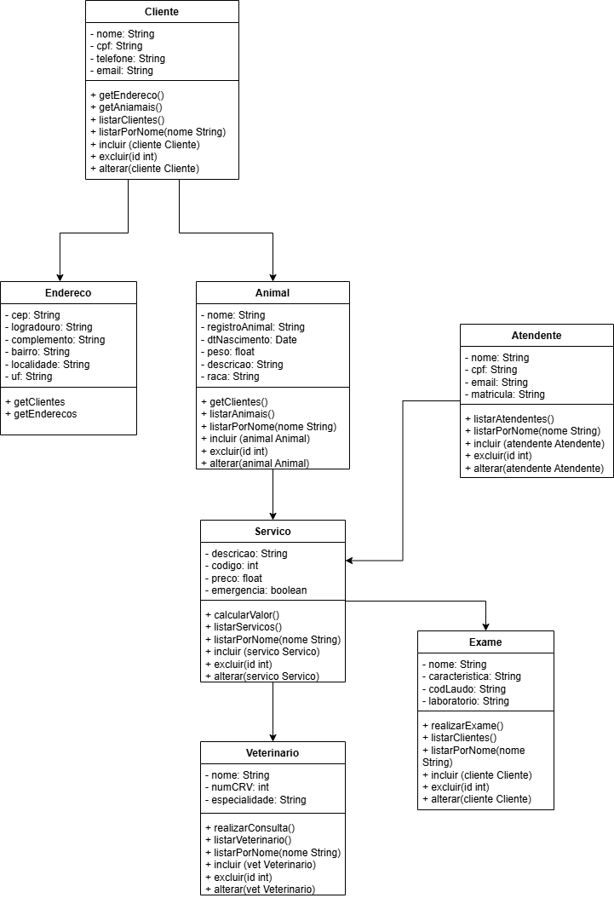
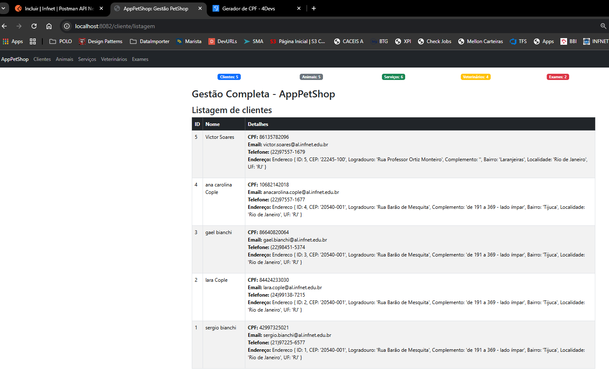
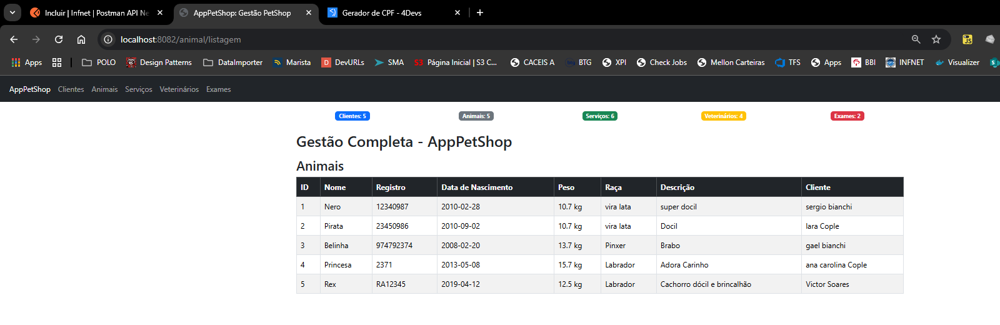
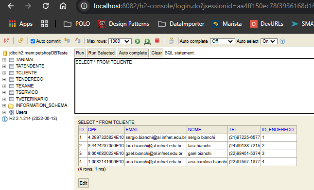
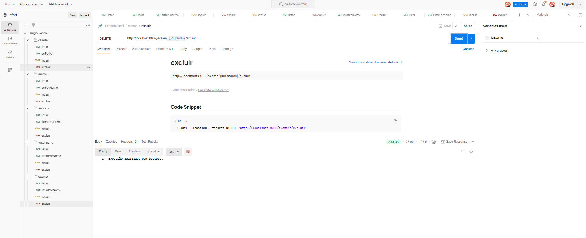
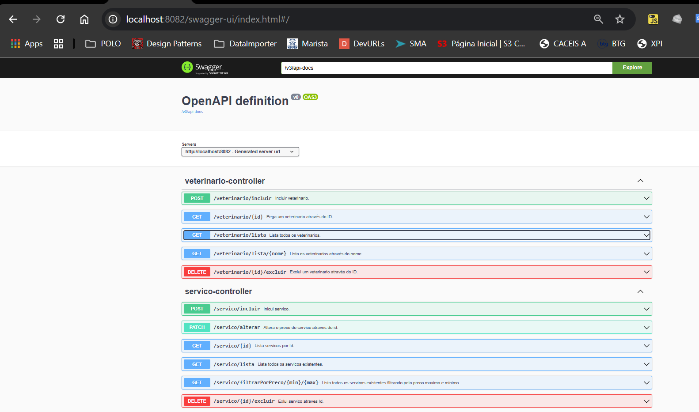
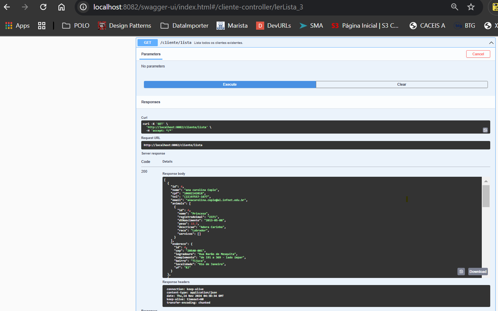

# Arquitetura Java - Projeto PetShopJava

Este projeto faz parte do estudo de Arquitetura Java e será desenvolvido em quatro etapas. Nesta primeira entrega, implementei a funcionalidade de **Cadastro de Clientes e Serviços**, que permite registrar clientes com seus respectivos serviços (Veterinário e Exame) em um sistema básico utilizando Spring Boot.

## Arquitetura do Sistema

Abaixo, o diagrama de arquitetura do sistema, que ilustra as principais interações entre as classes e componentes do sistema de PetShop:



## Interface do Usuário

As capturas de tela abaixo mostram as principais funcionalidades da interface.





## Banco de dados



## Postman
Abaixo, a tela de com o Postman:



## Swagger
Abaixo, a tela de com o Swagger:






## Projeto
O projeto será dividido em quatro features distintas para atender às necessidades do desenvolvimento ágil. A divisão em features permite:

- **Flexibilidade e Entrega Iterativa**: Entregas frequentes que respondem rapidamente a mudanças nos requisitos.
- **Priorização de Valor**: Implementação das funcionalidades mais cruciais primeiro.
- **Feedback Contínuo**: Clientes podem fornecer feedback mais cedo, possibilitando melhorias contínuas.
- **Transparência e Comunicação Eficaz**: A definição clara das features facilita a comunicação e colaboração.
- **Redução de Riscos**: Dividir o projeto em features ajuda a identificar problemas antecipadamente.

### Feature 01
Estabelece a base do sistema de PetShop, com criação de classes de domínio, leitura de dados e funcionalidades básicas de serviço.

1. **Criação das Classes de Domínio**: Desenvolver as entidades fundamentais conforme o diagrama (ex: Clientes e Servicos).
2. **Atributos e Relacionamentos**: Implementar atributos por classe e definir os relacionamentos.
3. **Utilização de Tipos de Dados**: Aplicar tipos fundamentais.
4. **Classes Loader**: Criar para leitura de arquivos texto e popular objetos.
5. **Classes @Service**: Incluir métodos `incluir`, `listar`, `lerPorId`, `lerPorNome`, `excluir` e `alterar`.
6. **Armazenamento no Map**: Utilizar Map para armazenamento temporário.

## Feature 02
Foco na criação da infraestrutura de banco de dados para suportar dados de maneira escalável e eficiente.

1. **Configuração do Banco de Dados e Datasource**: Criação e configuração de um banco de dados relacional.
2. **Mapeamento de Classes para Entidades**: Definir as classes de domínio como entidades de banco.
3. **Relacionamento OneToMany**: Associar cliente a múltiplos Servicos.
4. **Herança entre Servicos**: Modelar diferentes tipos de Servicos (ex: Exames e Veterinarios).
5. **Interfaces @Repository**: Estender `CrudRepository` para operações CRUD.
6. **Injeção de Dependência nos Services**: Utilizar `@Repository` nas classes de serviço.
7. **Eliminação do Map**: Passar a usar o banco de dados após configuração.
8. **Atualização das Classes Loader**: Adaptar para associar Servicos a Clientes.

## Feature 03
Melhoria na usabilidade com tela de visualização de dados, validações, e integração com API de CEP.

1. **Tela de Visualização de Dados**: Criar interface para exibir registros das tabelas do banco.
2. **Quantidade de Registros**: Exibir contagem de registros de cada tabela.
3. **Classe de Controle Única**: Roteamento centralizado para navegação.
4. **Validações de Dados**: Aplicar anotações (`@Size`, `@Pattern`, etc.) para garantir integridade.
5. **Tratamento de Exceções nas Loaders**: Manter a integridade ao tratar erros de inclusão.
6. **Rotas para Exclusão**: Criar rotas para remoção de dados.
7. **Classe para Representar CEP**: Definir campos e métodos para CEP do cliente.
8. **Consumo da API de CEP**: Recuperar e associar dados de CEP ao cliente no banco.

## Feature 04
Foco na interação avançada com dados, incluindo exclusão, ordenação, busca unificada e integração com API.

1. **Ajuste no Processo de Exclusão**: Prevenir dados órfãos entre relacionamentos.
2. **Organização Personalizada**: Critérios específicos de ordenação por contexto.
3. **Busca Unificada**: Pesquisa centralizada para acesso rápido aos dados.
4. **API para Cadastro**: Implementar endpoints para `incluir` e `excluir`.
5. **Integração do Frontend com API**: Consumir novos endpoints e refletir na interface.
6. **Atualização da Tela Home**: Exibir informações da API na tela inicial.
7. **Novos Endpoints na API**: Adicionar `incluir` e `excluir` para operações CRUD completas.
8. **Configuração da API para Suporte aos Novos Endpoints**: Implementar autenticação e validação.

> Este planejamento garante uma abordagem ágil e eficiente no desenvolvimento do software de PetShop.

## Estrutura do Projeto

- **`br.edu.infnet.sergioB.sergioBApplication`**: Classe principal do projeto Spring Boot.
- **`br.edu.infnet.sergioB.Loader`**: Classe responsável por carregar dados iniciais a partir de um arquivo de texto.

### Domínio

- **Cliente**: Representa o cliente e contém uma lista de serviços associados.
- **Serviço**: Classe abstrata que representa serviços gerais.
  - **Veterinário**: Subclasse de Serviço que representa serviços veterinários.
  - **Exame**: Subclasse de Serviço que representa serviços de exame.
- **Endereço**: Representa o endereço do cliente.
- **Atendente**: Classe do atendente que recebeu o cliente.

### Serviço

- **`ClienteService`**: Classe responsável pela inclusão e recuperação dos clientes cadastrados.

## Arquivo de Entrada

Os clientes e serviços são cadastrados automaticamente a partir do arquivo `files/Clientes.txt`. O arquivo deve seguir o seguinte formato:

```plaintext
c;sergio bianchi;42997325021;(21)97225-6577;sergio.bianchi@al.infnet.edu.br;22245-100
a;Nero;12340987;28/02/2010;10.7;vira lata;super docil;
c;lara bianchi;84424233030;(24)99138-7215;lara.bianchi@al.infnet.edu.br;22245-100
a;Pirata;23450986;02/09/2010;10.7;vira lata;Brabo;
c;gael bianchi;86640820064;(22)98451-5374;gael.bianchi@al.infnet.edu.br;22245-100
c;ana carolina bianchi;10682142018;(22)97557-1677;ana.bianchi@al.infnet.edu.br;22245-100
```

## Tecnologias Utilizadas

Abaixo estão as principais tecnologias utilizadas no projeto, incluindo a versão do Java, o framework para o backend, o sistema de gerenciamento de dependências, o banco de dados, a configuração de servidor e as bibliotecas de suporte:

1. **Java 11**
   - O projeto é desenvolvido utilizando **Java 11**, garantindo compatibilidade com versões modernas da linguagem e o suporte a melhorias de desempenho e segurança.

2. **Spring Boot 2.7.5**
   - **spring.application.name**: Define o nome da aplicação como `sergioB`.
   - **Servidor embutido**: Configuração para rodar na porta `8082`.
   - **spring.h2.console.enabled**: Ativação do console H2 para acesso ao banco de dados em memória.
   - **Versão 2.7.5**: A versão **2.7.5** do Spring Boot oferece melhorias em desempenho, segurança e suporte de integração com outras tecnologias Spring.

3. **Maven**
   - O projeto utiliza o **Maven** como sistema de gerenciamento de dependências e build, o que facilita a configuração, a organização e o gerenciamento de pacotes e plugins necessários ao desenvolvimento.

4. **Banco de Dados em Memória H2**
   - **spring.datasource.url**: Define a URL do banco como `jdbc:h2:mem:petshopDBTeste`, uma base de dados H2 em memória, facilitando testes rápidos.
   - **spring.datasource.driverClassName**: Especifica o driver do H2 `org.h2.Driver`.
   - **spring.datasource.username e password**: Configura o acesso ao banco de dados, com o usuário `sa` e senha em branco.
   - **spring.jpa.database-platform**: Define o dialeto do Hibernate para H2 (`org.hibernate.dialect.H2Dialect`).
   - **spring.jpa.hibernate.ddl-auto**: Configuração de `create-drop` para criação e exclusão do esquema automaticamente ao iniciar e parar a aplicação.

5. **Spring MVC e JSP**
   - **spring.mvc.view.prefix e suffix**: Define o prefixo e o sufixo para os arquivos de visualização, localizados em `/WEB-INF/jsp/` e com extensão `.jsp`.
   - **Integração com JSP**: Permite o uso de JSP como tecnologia de visualização para gerar páginas dinâmicas.

6. **Configurações de Debug e Logging**
   - **server.port e debug**: Define a porta do servidor (`8082`) e habilita o modo de depuração para informações detalhadas de log.
   - **logging.level**: Configura níveis de log detalhados para o Spring Web, Hibernate e o Spring em geral, todos no nível `DEBUG`.

7. **Hibernate e JPA**
   - **spring.jpa.show-sql**: Habilita a visualização das instruções SQL geradas pelo Hibernate, facilitando o rastreamento e a depuração de operações de banco de dados.

Essas configurações permitem um desenvolvimento rápido e eficiente, com o uso de um banco de dados em memória para testes, detalhamento de logs para acompanhamento das operações e uma arquitetura baseada no Spring Boot e Spring MVC.

## Como Executar

1. Clone este repositório.
2. Certifique-se de que o Java 11 e o Maven estão instalados em sua máquina.
3. Compile o projeto executando:
```bash
mvn clean install
```
## Configurações Importantes

Para o funcionamento do projeto, configuramos algumas propriedades no arquivo `application.properties`:

## Properties
# Nome da aplicação
```bash 
spring.application.name=sergioB
```

# Console do banco de dados H2
```bash 
spring.h2.console.enabled=true
```

# Configuração do datasource para o banco de dados H2 em memória
```bash 
spring.datasource.url=jdbc:h2:mem:petshopDBTeste;DB_CLOSE_DELAY=-1;DB_CLOSE_ON_EXIT=TRUE
spring.datasource.driverClassName=org.h2.Driver
spring.datasource.username=sa
spring.datasource.password=
```

# Configuração do JPA e Hibernate
```bash 
spring.jpa.database-platform=org.hibernate.dialect.H2Dialect
spring.jpa.show-sql=true
spring.jpa.hibernate.ddl-auto=create-drop
```

# Configuração das views e do prefixo/sufixo para JSP
```bash 
spring.mvc.view.prefix=/WEB-INF/jsp/
spring.mvc.view.suffix=.jsp
```

# Configuração do servidor
```bash 
server.port=8082
debug=true
```

# Configurações de logging detalhadas para depuração
```bash 
logging.level.org.springframework.web=DEBUG
logging.level.org.hibernate=DEBUG
logging.level.org.springframework=DEBUG
logging.level.root=DEBUG
```

### Detalhes das Configurações
- **Banco de Dados H2**: Configurado como banco de dados em memória para facilitar o desenvolvimento.
- **Console H2**: Ativado para acessar e visualizar o banco de dados em localhost:8082/h2-console.
- **Servidor na Porta 8082**: A aplicação está configurada para iniciar na porta 8082.
- **Modo de Depuração**: O modo de depuração está habilitado para facilitar o acompanhamento de logs e detalhes durante o desenvolvimento.

## Argumentos de Execução
Ao iniciar a aplicação, estamos passando o argumento --server.port=8082 para permitir que o servidor rode na porta 8082. Dessa forma, caso a porta 8081 já esteja em uso, a aplicação poderá utilizar a porta 8082.


## Autor
**Sergio Bianchi**

